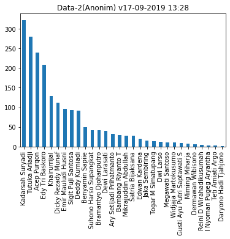
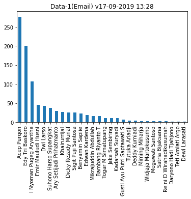
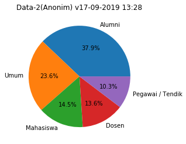
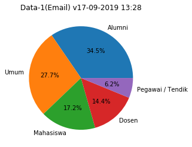
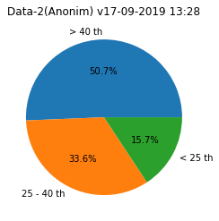
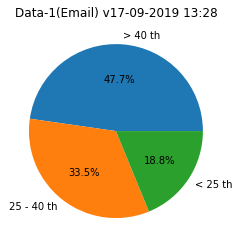
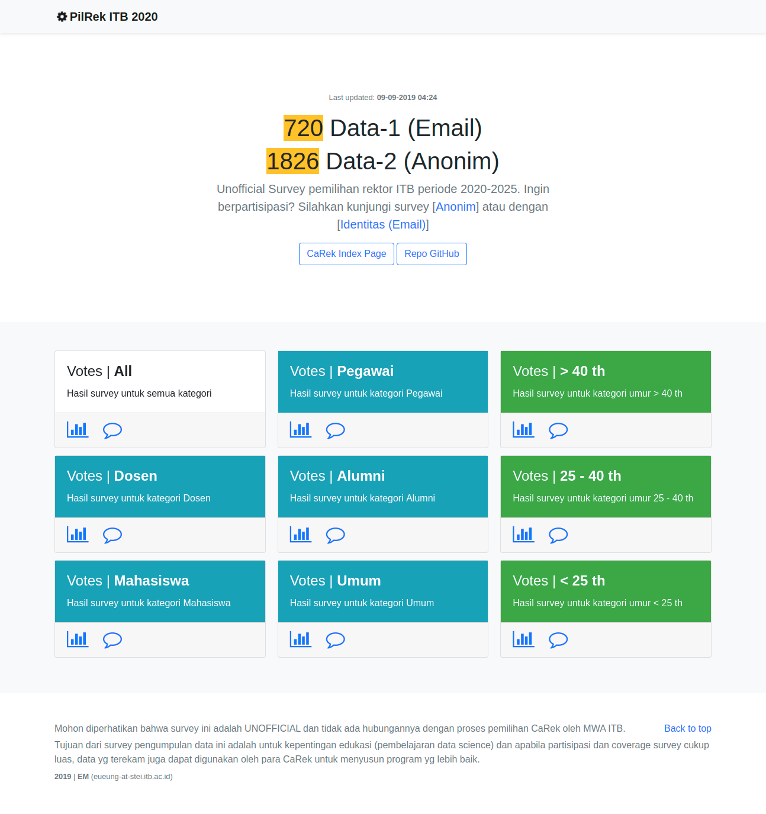

# Survey UNOFFICIAL Pemilihan Rektor ITB 2020

Repo ini berisi beberapa seed jupyter notebook dan raw data survey berikut:

- http://bit.ly/pilrekitb2020 (dengan identitas email)
- http://bit.ly/pilrekitb2020-anon (anonim, tanpa identitas)

Mohon diperhatikan bahwa survey ini adalah NON-FORMAL UNOFFICIAL dan tidak ada hubungannya dengan proses pemilihan CaRek oleh MWA ITB. 

Beberapa grafik visualisasi dan data setelah processing dapat dilihat di https://eueung.github.io/pilrek/

Tujuan dari survey pengumpulan data ini antara lain adalah:
- untuk digunakan dalam pembelajaran data science (e.g. ET-3107 Advanced Programming)
- apabila partisipasi dan coverage survey cukup luas, data masukan audiens juga akan disosialisasikan kepada civitas dengan harapan dapat sampai kepada para CaRek sehingga dapat konstruktif untuk kebaikan dan kemajuan bersama.

Raw data akan diperbaharui secara berkala, sesuai dengan data yg terekam oleh form survey.

## Akses Jupyter Notebook (Google Colab)

- [Data Survey](https://colab.research.google.com/github/eueung/pilrek/blob/master/pilrek.ipynb)
- [Data Survey Anonim](https://colab.research.google.com/github/eueung/pilrek/blob/master/pilrek-anon.ipynb)

## Hasil Sementara (17-09-2019 13:28)

## Data Post-Processing & Web Render

Visualisasi lain dan hasil data post-processing dapat dilihat di [GitHub Pages](https://eueung.github.io/pilrek/).

## Lisensi

MIT